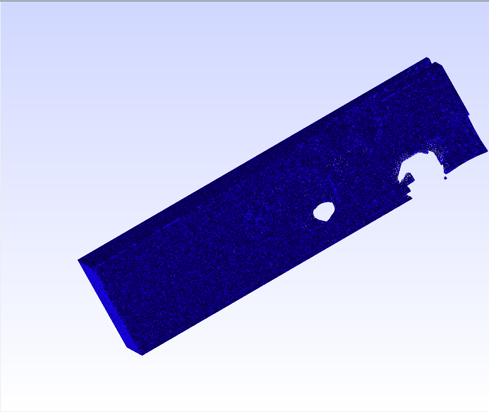
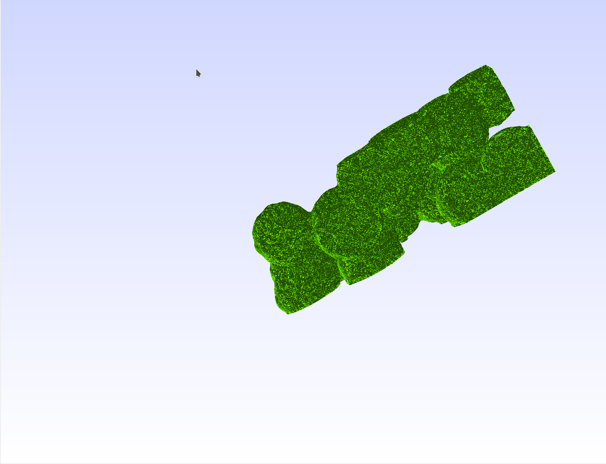
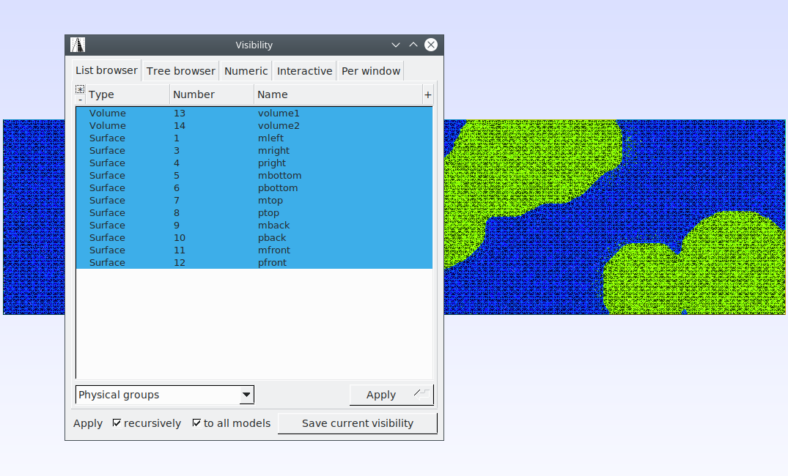

# cRVE
cpp code to split the boundaries of electrolyte and matrix for the mesh file generated by stl in Gmsh.

Step-1. generate the RVE in [GeoDict](https://www.math2market.com/Solutions/aboutGD.php), which should give you the *.stl file.

Step-2. generate the msh file use Gmsh, which should give you the volume mesh but no any surface or boundary mesh information.

Step-3. label out all the boundaries use cRVE, especially the common surface where the particles are contacted with the cubic's edge surfaces.

# Install
```shell
git clone https://github.com/walkandthinker/cRVE.git

cd cRVE

cmake CMakeLists.txt && make -j4
```
after that, an executable file names 'crve' should be found under the 'bin' folder.

# Usage
For some basic introduction, one can use:
```
crve -help
```
which should print out:
```
*************************************************************************
*** Welcome to use cRVE (a simple cpp script to modify msh file)!     ***
*** Options:                                                          ***
***  -help            ---> print this message                         ***
***  -i test.msh      ---> i for input, msh file should follow it!    ***
***  -tol tolerance   ---> set tolerance for mesh splitting           ***
***  -bounall[enable] ---> assign mx[y,z]min/max to cubic's boundary  ***
***                        assign px[y,z]min/max to cubic's boundary  ***
***  -bounmat[disable]---> assign mx[y,z]min/max to matrix's boundary ***
***                        only matrix is splitted in this case!!!    ***
***  -bounpar[disable]---> assign px[y,z]min/max to particle boundary ***
***                        only particle is splitted in this case!!!  ***
***  -print[enable]   ---> print out the results information          ***
*** Author: walkandthinker@CopyRight                                  ***
*** Contact: walkandthinker@gmail.com                                 ***
*************************************************************************
```

# Result
before split, the rve looks like:
matrix                     |  particle
:-------------------------:|:-------------------------:
    |  

after split, they looks like:
split result               |  physical info
:-------------------------:|:-------------------------:
     |  
the print message for this job should looks like:

```
a successful job print should looks like:
*************************************************************************
*** Job information summary:                                          ***
***   Xmax=  6.000000e+01,  Xmin=  0.000000e+00,  Cx= 2.943449e+01    ***
***   Ymax=  1.500000e+01,  Ymin=  0.000000e+00,  Cy= 7.543953e+00    ***
***   Zmax=  1.500000e+01,  Zmin=  0.000000e+00,  Cz= 7.387744e+00    ***
***   Physical group IDs=  0 , max dim= 3, min dim= 3, tol=1.0000e-01 ***
***   Mesh has      2 unique pyhsical ids                             ***
***   Split both the matrix and particles boundaries                  ***
***   Final physical group information:                               ***
***   Physical ID-------physical dim--------------physical name       ***
***       1                 2                             mleft       ***
***       2                 2                             pleft       ***
***       3                 2                            mright       ***
***       4                 2                            pright       ***
***       5                 2                           mbottom       ***
***       6                 2                           pbottom       ***
***       7                 2                              mtop       ***
***       8                 2                              ptop       ***
***       9                 2                             mback       ***
***      10                 2                             pback       ***
***      11                 2                            mfront       ***
***      12                 2                            pfront       ***
***      13                 3                           volume1       ***
***      14                 3                           volume2       ***
*************************************************************************
*** Write results to                         new_dns.msh              ***
*** Time elapse:     4.800271e+00 [s]                                 ***
*************************************************************************
```


# Author
[Yang](mailto:walkandthinker@gmail.com)

Feel free to contact me if you have any problems.
